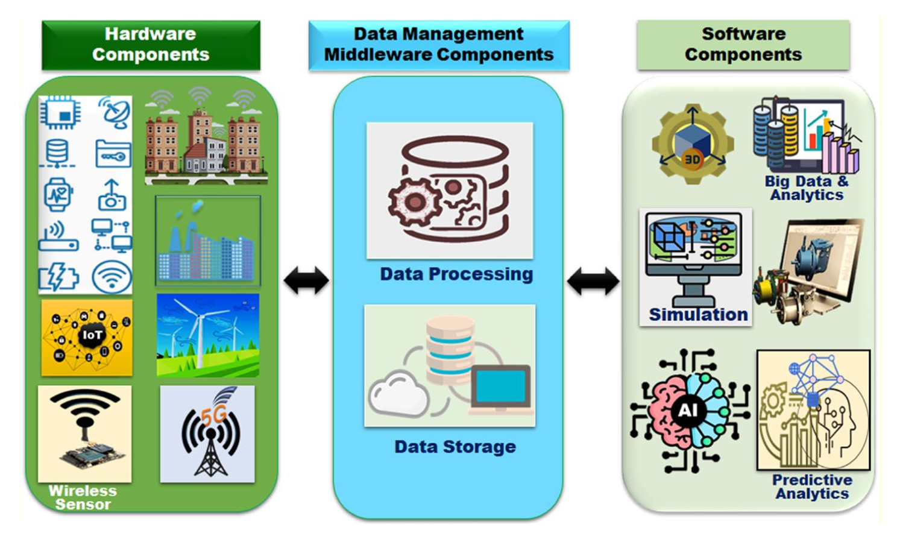
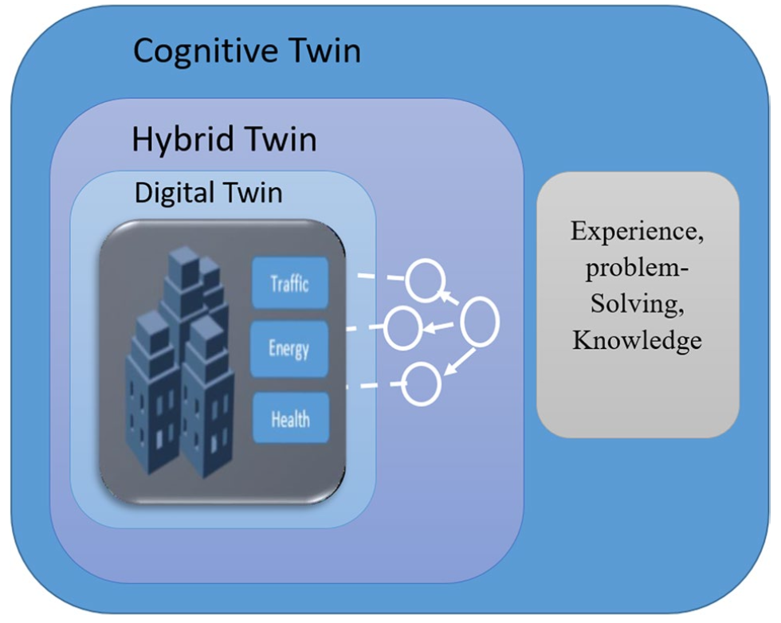
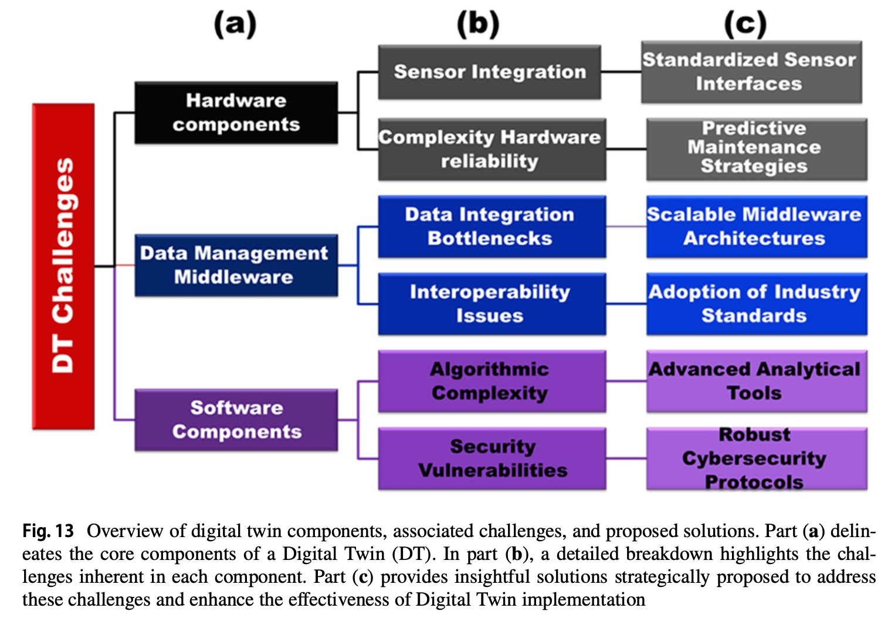

Research Paper Overview
===

<!-- column_layout: [2, 1] -->

<!-- column: 0 -->

<!-- column: 1 -->

<!-- reset_layout -->

- Research Paper: [Comprehensive analysis of digital twins in smart cities: a 4200‑paper bibliometric study](https://doi.org/10.1007/s10462-024-10781-8)

<!-- end_slide -->

Challenges
===

<!-- end_slide -->

Softwares
===
- Completed 3 of 6 modules of a course in `Unity Essentials`
- Created a small car game to understand about the Unity engine and assets customization
- Mini Project: 3D human motion capture using python
    - uses computer vision to capture the human motion and export it into landmarks which is later used in Unity to render the movements of that human object.

<!-- end_slide -->

Progress target for next 15 days
=== 

- 4-7 research papers on Intelligent Transportation System and understand the achitectures and use of AI discussed in those papers.
- Dive deeper into `Object Detection`
- Modify the 3D motion capture project  for `Vehicles` to simultaneously detect and render in Unity.